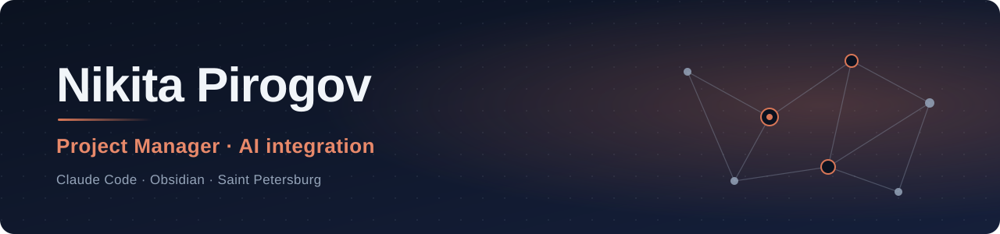

6+ лет веду сложные проекты, где нужно свести заказчика, подрядчиков, госорганы и технические комитеты: от городского строительства до нормотворчества с федеральным партнёром. Последний год строю личную систему на Claude Code и Obsidian: агент поверх базы знаний, который помнит контекст между сессиями.

**Сейчас:** строю [второй мозг](https://github.com/NUNUICHTODALSHE/my-second-brain) на Obsidian и Claude Code, ищу роль менеджера проектов в AI / IT.

---

## Чем занимался

- **ГорУКС (Кемерово), 2020–2024. Заказчик / технический заказчик.** Городские объекты: дороги, мосты, инженерные сети, благоустройство. До 10 объектов параллельно, весь цикл от ТЗ и закупок до госэкспертизы, разрешения на строительство и ввода.
- **Энтемс (Санкт-Петербург), 2024–2025. Координатор проектов.** Субподрядчики, договоры, ТЗ, протоколы, документооборот.
- **Гидрокор (Санкт-Петербург), 2025–наст. время. Project Manager.** Три параллельных трека с федеральным партнёром, технические комитеты, актуализация ГОСТ, испытательные лаборатории.

## Что делаю с AI

- **RAG-база на Obsidian + Claude Code.** Поиск по сотням связанных документов: ответы на вопросы обычным языком со ссылками на источники.
- **LLM, RLM, SLM.** Каждый день работаю с LLM (Claude), слежу за reasoning-моделями (RLM) и компактными моделями (SLM) и понимаю, где какие уместны.
- **Prompt- и context-инжиниринг.** Zero-shot, few-shot, chain-of-thought, self-consistency, ролевые промпты, агентные пайплайны.
- **Скиллы.** Свои переиспользуемые промпт-пайплайны: редактура текста, планирование через интервью, разбор видео, диаграммы.
- **Хуки.** Автоматические действия на события Claude Code: отправка промпта, вызов инструмента, запрос разрешения, остановка.
- **Субагенты.** Отдельные агенты под узкие задачи: массовый просмотр файлов, разбор материалов.
- **CLAUDE.md.** Свод правил для агента: как обрабатывать материал, как сверять новое со старым, как вести wiki.
- **Долговременная память.** Один факт, один файл, общий индекс. Агент в начале сессии сам поднимает незакрытые вопросы.
- **Автоматизация.** Протоколирование совещаний, транскрипция аудио и видео через Whisper API, напоминания и календарь, дашборд на Dataview.
- **Telegram-бот** как канал ввода в базу знаний.
- **Python.** Учу: читаю и дорабатываю код в связке с Claude Code.

Описание системы: [my-second-brain](https://github.com/NUNUICHTODALSHE/my-second-brain)

## Инструменты

**Управление проектами:**

**AI и автоматизация:**

---

## Contact

Telegram: [@lookatme3300](https://t.me/lookatme3300) · Saint Petersburg, Russia

## In English

Project manager with 6+ years of experience in construction and infrastructure projects: customer / technical customer for city objects, project coordination in commercial development, and a multi-party standards initiative with a federal partner. For the past year I have been building a personal knowledge system on Claude Code and Obsidian: a RAG knowledge base, skills, hooks, subagents, cross-session memory, and meeting-minutes automation. Looking for a project manager role in AI / IT.
